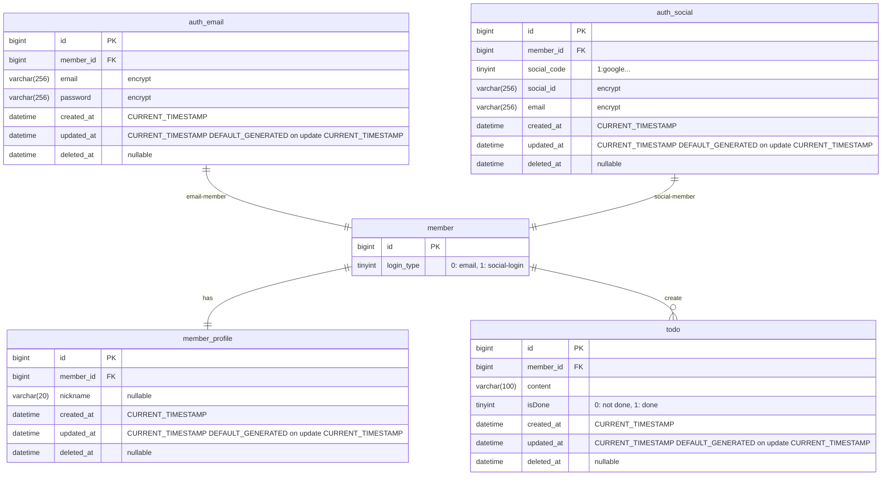

```mermaid
erDiagram

member {
    bigint id PK
    tinyint login_type "0: email, 1: social-login"
}

member_profile {
    bigint id PK
    bigint member_id FK
    varchar(20) nickname "nullable"
    datetime created_at "CURRENT_TIMESTAMP"
    datetime updated_at "CURRENT_TIMESTAMP DEFAULT_GENERATED on update CURRENT_TIMESTAMP"
    datetime deleted_at "nullable"
}

member ||--|| member_profile : has

auth_social {
    bigint id PK
    bigint member_id FK
    tinyint social_code "1:google..."
    varchar(256) social_id "encrypt"
    varchar(256) email "encrypt"
    datetime created_at "CURRENT_TIMESTAMP"
    datetime updated_at "CURRENT_TIMESTAMP DEFAULT_GENERATED on update CURRENT_TIMESTAMP"
    datetime deleted_at "nullable"
}

auth_email {
    bigint id PK
    bigint member_id FK
    varchar(256) email "encrypt"
    varchar(256) password "encrypt"
    datetime created_at "CURRENT_TIMESTAMP"
    datetime updated_at "CURRENT_TIMESTAMP DEFAULT_GENERATED on update CURRENT_TIMESTAMP"
    datetime deleted_at "nullable"
}

auth_email ||--|| member: email-member
auth_social ||--|| member: social-member

todo {
    bigint id PK
    bigint member_id FK
    varchar(100) content
    tinyint isDone "0: not done, 1: done"
    datetime created_at "CURRENT_TIMESTAMP"
    datetime updated_at "CURRENT_TIMESTAMP DEFAULT_GENERATED on update CURRENT_TIMESTAMP"
    datetime deleted_at "nullable"
}

member ||--o{ todo : create

```
